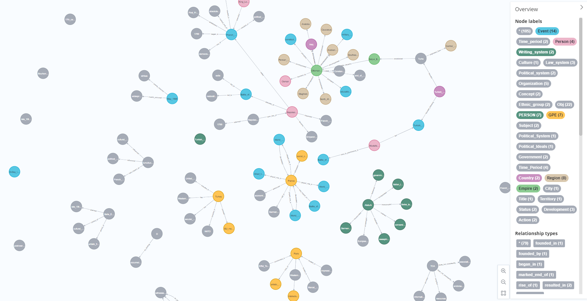

# graph_chatbot

Install the packages requirements.txt from   
Replace with your API key at app.py and replace database information at neo4j_utils.py  
Activate APOC plugin on NEO4J Database.  
Run app.py to start the chatbot.  
There is a special command to load file and build the knowledge graph: generate from file:"file_path" 
Supported Document Formats:
<ul>
    <li>txt</li>
    <li>pdf</li>
</ul>
If you run the turkish_history.txt and french_history.pdf files among the sample data sets, you will create a knowledge graph containing summary information about Turkish and French history.

